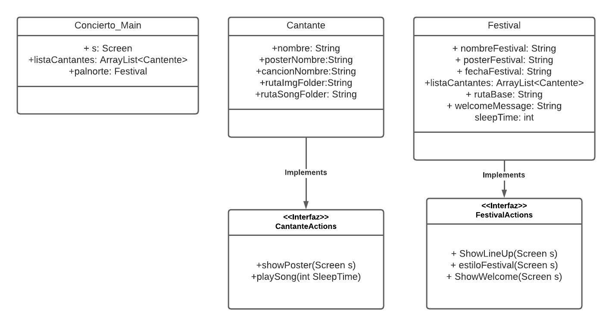

# Practica LineUp

## Objetivo:
Diseñar el Lineup de un concierto que deberá contener una imagen y canción para cada artista para practicar el uso de Multi hilos.

### Diagrama de Clase

### Programa (Video)
[Video](https://youtube.com/shorts/UqUu9zbDR7E?feature=share)

### Programa (Gif)
