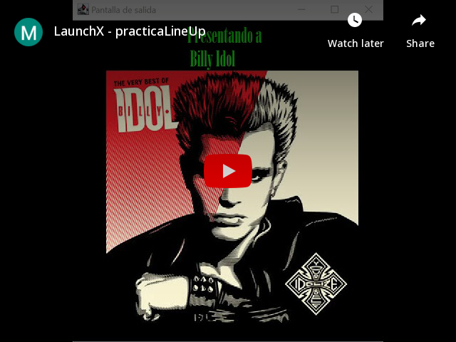

# Practica LineUp

## Objetivo:
Diseñar el Lineup de un concierto que deberá contener una imagen y canción para cada artista para practicar el uso de Multi hilos.

### Diagrama de Clase
    

### Programa (Gif)
    

### Programa (Video)

